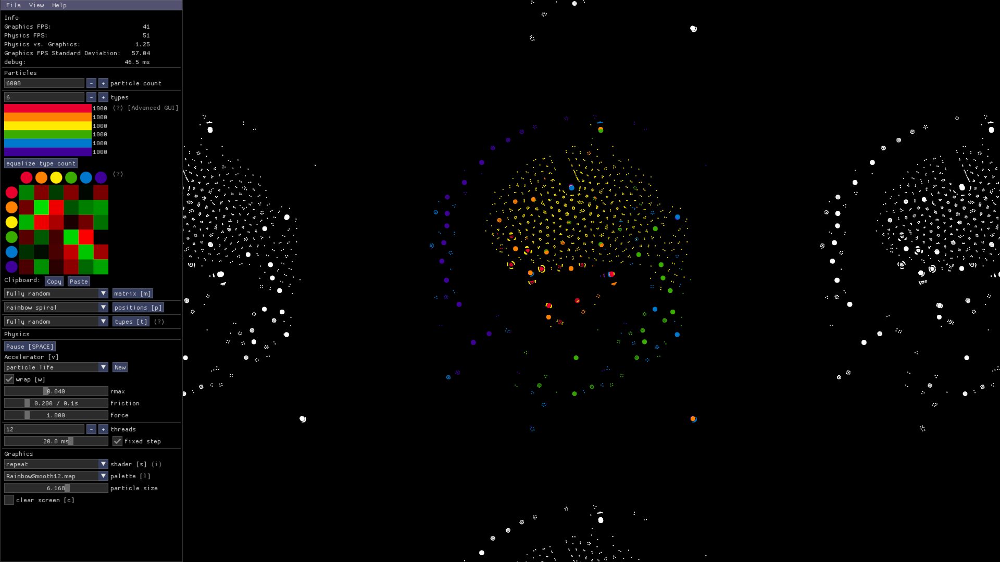

# 🦠 Particle Life App

A GUI for the [Particle Life Framework](https://github.com/tom-mohr/particle-life).

- [Download](https://particle-life.com) (.exe for Windows)
- [Documentation](https://particle-life.com/docs)

Join the [Discord server](https://discord.gg/Fd64AhKzMD)!



## Run This App From Source

You can easily run this app from the source code.

First, check that you have

- [Git](https://git-scm.com/downloads) installed.
- [Java](https://jdk.java.net/19/) installed, with a version of at least 17 and at most 25.
  (Check your version with `java -version`.)
  (Note: This is required in order to run the `./gradlew` command below, which uses Gradle 9.2.1.)

Your local Java version is only needed to run Gradle.
The app itself will run with Java 21, which Gradle will download automatically.

Then, download the source code:
```bash
git clone https://github.com/tom-mohr/particle-life-app.git
```

Navigate into the folder and run the app:
```bash
cd particle-life-app
./gradlew run
```

After some time, the program should launch and you should see particles on your screen.
Feel free to mess with the code!

## Troubleshooting

If you encounter any problems, ask for help in the [`#tech-support`](https://discord.gg/EVG8XnCn3U) channel on the Discord server.

## How to make a release (on Windows)

- Confirm that everything is working correctly and check in with others
  that the current state of the main branch is ready for release.
- Choose a new version string.
  You can find the current version string in `gradle.properties`.
  The version name should comply with [semantic versioning](https://semver.org/).
  Talk to others if you are unsure about what to choose here.
- Update the current version string in `gradle.properties`.
- Run `./gradlew zipApp` from the project root.
  This generates the zip file `particle-life-app.zip` in `./build/zipApp/`.
  It includes the Windows executable (`.exe`) along with other files.
- Go to the [Releases](https://github.com/tom-mohr/particle-life-app/releases) section of this GitHub repo and click `Draft a new release`.
- Click `Choose a tag` and type the new version name, but prefixed with `v`, e.g. `v1.2.3`.
  Click `Create a new tag`.
- Set the release title to match the tag name.
- Use the description to summarize the changes of all commits since the last release.
- Add the generated `particle-life-app.zip` as an asset to the release.
- Click `Publish release`.
